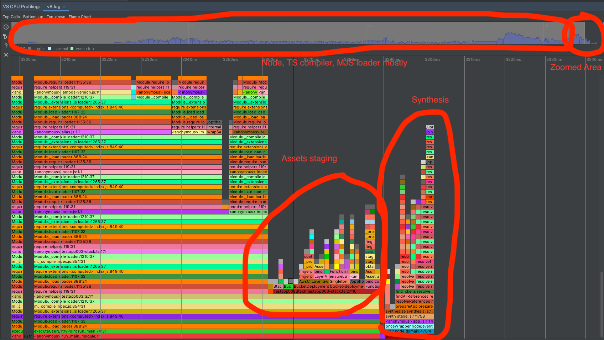
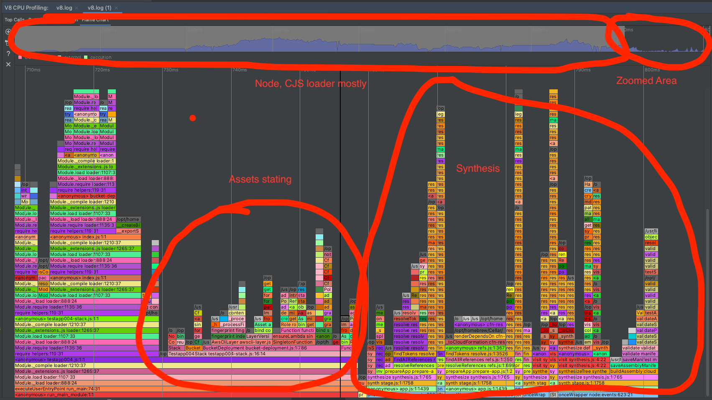

# Setup

All changes made to the code can be reviewed in https://github.com/sobolk/aws-cdk/pull/1 .

## CDK packages

CDK packages has been changed to:
1. Measure execution time of synthesis closer to a place that uses CDK app.
2. Added ability to inject CDK app into CDK cli to eliminate IPC calls.

## Test apps

All test apps have same set of resources:
1. Three lambda functions
2. S3 Bucket
3. S3 Bucket deployment

All test apps has been instrumented to measure time of imports and actual logic execution.

### testapp001

1. Created with `cdk init app --language typescript`
2. Is linked through filesystem to CDK packages, i.e. `"aws-cdk-lib": "file:../../packages/aws-cdk-lib"` and `"aws-cdk": "file:../../packages/aws-cdk"`
3. The `--prefer-ts-exts` parameter has been removed from `app` in `cdk.json` to prevent `ts-node` from compiling linked CDK packages
4. Has the following scenarios:
   1. `testapp001.ts` - basic CDK app
   2. `testapp001.no-ipc.ts` - injects basic CDK app into programmatic CLI call to avoid IPC
   3. `testapp001.extra-ipc.ts` - simulates Amplify scenario, i.e. Amplify IPC-calling CDK cli, CDK cli IPC-calling basic CDK app.
   4. `testapp001.extra-no-ipc.ts` - simulates Amplify scenario, but with all IPC calls removed.
   5. `testapp001.extra-ipc-many-deployments.ts` - variation of `testapp002.extra-ipc.ts` that executes same scenario 10 times in a loop.
   6. `testapp001.extra-no-ipc-many-deployments.ts` - variation of `testapp001.extra-no-ipc.ts` that executes same scenario 10 times in a loop.

### testapp002

The `testapp002` is a copy of `testapp001` converted to Javascript.

1. Created with `cdk init app --language javascript`
2. Is linked through filesystem to CDK packages, i.e. `"aws-cdk-lib": "file:../../packages/aws-cdk-lib"` and `"aws-cdk": "file:../../packages/aws-cdk"`
3. Copied logic from `testapp001` converted to Javascript. It has exact same scenarios but in Javascript.

### testapp003

The `testapp003` is a sibling of `testapp001`. The purpose is to check if linking CDK packages via file system brings observable differences in experiments.

1. Created with `cdk init app --language typescript`
2. Dependencies left as is.
3. Has the following scenarios:
   1. `testapp003.ts` - basic CDK app

### testapp004

The `testapp004` is a copy of `testapp003` converted to Javascript. The purpose and scenarios are the same.

1. Created with `cdk init app --language javascript`
2. Dependencies left as is.
3. Copied logic from `testapp003` converted to Javascript. It has exact same scenarios but in Javascript.

### testapp005

The `testapp005` is a copy of `testapp003` adapted to use CDK V1. The purpose is to see if V1 that was not monolithic is faster.

### testapp006

The `testapp006` is a copy of `testapp004` adapted to use CDK V1. The purpose is to see if V1 that was not monolithic is faster.

### testapp007

The `testapp007` is a copy of `testapp003` but with CDK 2.98.0 that includes https://github.com/aws/aws-cdk/pull/27217 .

### testapp008

The `testapp008` is a copy of `testapp004` but with CDK 2.98.0 that includes https://github.com/aws/aws-cdk/pull/27217 .

### testapp009

The `testapp009` is a copy of `testapp003` but is using `@swc/core` compiler per recommendations from https://typestrong.org/ts-node/docs/performance/.

This configuration disables type checking.

### testapp010

The `testapp010` is a copy of `testapp003` but is using `transpileOnly` flag per recommendations from https://typestrong.org/ts-node/docs/performance/.

This configuration disables type checking.

### testapp011

The `testapp011` is a copy of `testapp003` but is using `--files` and `skipLibCheck` flags per recommendations from https://typestrong.org/ts-node/docs/performance/.

This configuration preserves type checking.

# Experiment results

## Raw results

Raw results can be seen in `summary.md` as well as partial `.md` files scattered in `testapps` directory.
See https://github.com/sobolk/aws-cdk/blob/synth-experiments/testapps/summary.md .

Profiler results can be found in `v8.log` and `v8log.txt` files.

## Insights

### Single deployment

#### synth all scenarios

| Measurement                    | testapp001 basic | testapp001 no IPC | testapp001 extra IPC | testapp001 extra no IPC | testapp002 basic | testapp002 no IPC | testapp002 extra IPC | testapp002 extra no IPC | testapp003      | testapp004      | testapp005      | testapp006      | testapp007      | testapp008      | testapp009      | testapp010      | testapp011      |
|--------------------------------|------------------|-------------------|----------------------|-------------------------|------------------|-------------------|----------------------|-------------------------|-----------------|-----------------|-----------------|-----------------|-----------------|-----------------|-----------------|-----------------|-----------------|
| Stack all imports              | 0.122&pm;0.012s  | 0.117&pm;0.004s   | 0.111&pm;0.002s      | 0.117&pm;0.004s         | 0.113&pm;0.003s  | 0.112&pm;0.003s   | 0.112&pm;0.003s      | 0.112&pm;0.003s         | 0.071&pm;0.014s | 0.076&pm;0.014s | 0.123&pm;0.021s | 0.117&pm;0.022s | 0.001&pm;0.001s | 0.000&pm;0.000s | 0.001&pm;0.001s | 0.068&pm;0.009s | 0.065&pm;0.002s |
| App all imports                | 0.307&pm;0.026s  | 0.286&pm;0.006s   | 0.285&pm;0.002s      | 0.284&pm;0.007s         | 0.260&pm;0.005s  | 0.240&pm;0.005s   | 0.258&pm;0.007s      | 0.242&pm;0.008s         | 0.218&pm;0.033s | 0.208&pm;0.032s | 0.219&pm;0.036s | 0.197&pm;0.036s | 0.581&pm;0.004s | 0.591&pm;0.063s | 0.000&pm;0.000s | 0.211&pm;0.020s | 0.202&pm;0.003s |
| Stage.synth()                  | 0.037&pm;0.003s  | 0.031&pm;0.001s   | 0.035&pm;0.002s      | 0.033&pm;0.002s         | 0.035&pm;0.001s  | 0.031&pm;0.001s   | 0.035&pm;0.001s      | 0.032&pm;0.001s         | N/A             | N/A             | N/A             | N/A             | N/A             | N/A             | N/A             | N/A             | N/A             |
| Synth from CLI side            | 4.449&pm;0.108s  | 0.032&pm;0.001s   | 4.260&pm;0.019s      | 0.033&pm;0.002s         | 0.371&pm;0.010s  | 0.031&pm;0.001s   | 0.366&pm;0.010s      | 0.032&pm;0.001s         | N/A             | N/A             | N/A             | N/A             | N/A             | N/A             | N/A             | N/A             | N/A             |
| App total processing time      | 0.362&pm;0.028s  | 0.428&pm;0.008s   | 0.335&pm;0.003s      | 0.425&pm;0.012s         | 0.311&pm;0.006s  | 0.372&pm;0.007s   | 0.308&pm;0.009s      | 0.378&pm;0.012s         | 0.268&pm;0.035s | 0.259&pm;0.034s | 0.315&pm;0.038s | 0.263&pm;0.039s | 0.630&pm;0.004s | 0.639&pm;0.063s | 0.050&pm;0.002s | 0.260&pm;0.020s | 0.250&pm;0.004s |
| App processing time no imports | 0.055&pm;0.004s  | 0.143&pm;0.005s   | 0.050&pm;0.002s      | 0.141&pm;0.005s         | 0.051&pm;0.001s  | 0.132&pm;0.004s   | 0.050&pm;0.002s      | 0.136&pm;0.005s         | 0.050&pm;0.003s | 0.050&pm;0.002s | 0.097&pm;0.005s | 0.065&pm;0.003s | 0.049&pm;0.001s | 0.048&pm;0.001s | 0.050&pm;0.002s | 0.049&pm;0.001s | 0.048&pm;0.001s |
| real                           | 5.088&pm;0.172s  | 6.713&pm;0.098s   | 5.454&pm;0.035s      | 6.623&pm;0.123s         | 0.968&pm;0.013s  | 0.891&pm;0.031s   | 0.996&pm;0.015s      | 0.892&pm;0.026s         | 2.783&pm;0.222s | 0.915&pm;0.045s | 5.306&pm;0.297s | 3.978&pm;0.071s | 3.070&pm;0.018s | 1.276&pm;0.070s | 1.294&pm;0.125s | 1.305&pm;0.146s | 2.660&pm;0.012s |
| user                           | 7.453&pm;0.080s  | 9.587&pm;0.123s   | 8.577&pm;0.081s      | 9.513&pm;0.128s         | 0.955&pm;0.007s  | 0.906&pm;0.016s   | 0.975&pm;0.014s      | 0.903&pm;0.018s         | 3.939&pm;0.134s | 0.881&pm;0.026s | 6.000&pm;0.080s | 3.746&pm;0.047s | 4.278&pm;0.013s | 1.238&pm;0.014s | 1.199&pm;0.019s | 1.228&pm;0.019s | 3.875&pm;0.032s |
| sys                            | 0.817&pm;0.018s  | 1.138&pm;0.027s   | 0.823&pm;0.015s      | 1.127&pm;0.045s         | 0.176&pm;0.005s  | 0.166&pm;0.010s   | 0.172&pm;0.004s      | 0.168&pm;0.009s         | 0.411&pm;0.040s | 0.131&pm;0.007s | 0.935&pm;0.099s | 0.711&pm;0.019s | 0.479&pm;0.007s | 0.193&pm;0.007s | 0.213&pm;0.025s | 0.192&pm;0.021s | 0.394&pm;0.005s |

#### hotswap all scenarios

| Measurement                    | testapp001 basic | testapp001 no IPC | testapp001 extra IPC | testapp001 extra no IPC | testapp002 basic | testapp002 no IPC | testapp002 extra IPC | testapp002 extra no IPC | testapp003      | testapp004      | testapp005      | testapp006      | testapp007      | testapp008      | testapp009      | testapp010      | testapp011      |
|--------------------------------|------------------|-------------------|----------------------|-------------------------|------------------|-------------------|----------------------|-------------------------|-----------------|-----------------|-----------------|-----------------|-----------------|-----------------|-----------------|-----------------|-----------------|
| Stack all imports              | 0.115&pm;0.002s  | 0.121&pm;0.004s   | 0.114&pm;0.003s      | 0.118&pm;0.003s         | 0.112&pm;0.004s  | 0.114&pm;0.004s   | 0.110&pm;0.002s      | 0.112&pm;0.002s         | 0.069&pm;0.007s | 0.073&pm;0.005s | 0.111&pm;0.006s | 0.109&pm;0.003s | 0.001&pm;0.001s | 0.000&pm;0.000s | 0.001&pm;0.000s | 0.066&pm;0.003s | 0.064&pm;0.002s |
| App all imports                | 0.294&pm;0.003s  | 0.294&pm;0.008s   | 0.292&pm;0.003s      | 0.288&pm;0.006s         | 0.258&pm;0.010s  | 0.246&pm;0.007s   | 0.257&pm;0.004s      | 0.243&pm;0.004s         | 0.216&pm;0.020s | 0.213&pm;0.033s | 0.199&pm;0.007s | 0.185&pm;0.006s | 0.580&pm;0.006s | 0.568&pm;0.010s | 0.000&pm;0.000s | 0.206&pm;0.006s | 0.203&pm;0.004s |
| Stage.synth()                  | 0.036&pm;0.002s  | 0.032&pm;0.001s   | 0.037&pm;0.003s      | 0.031&pm;0.001s         | 0.035&pm;0.002s  | 0.032&pm;0.001s   | 0.035&pm;0.001s      | 0.032&pm;0.001s         | N/A             | N/A             | N/A             | N/A             | N/A             | N/A             | N/A             | N/A             | N/A             |
| Synth from CLI side            | 4.392&pm;0.050s  | 0.032&pm;0.001s   | 4.397&pm;0.055s      | 0.031&pm;0.001s         | 0.369&pm;0.013s  | 0.033&pm;0.001s   | 0.365&pm;0.008s      | 0.033&pm;0.001s         | N/A             | N/A             | N/A             | N/A             | N/A             | N/A             | N/A             | N/A             | N/A             |
| App total processing time      | 0.346&pm;0.004s  | 2.251&pm;0.123s   | 0.344&pm;0.004s      | 2.295&pm;0.124s         | 0.310&pm;0.013s  | 1.839&pm;0.167s   | 0.308&pm;0.004s      | 1.802&pm;0.120s         | 0.270&pm;0.026s | 0.265&pm;0.037s | 0.297&pm;0.012s | 0.248&pm;0.007s | 0.629&pm;0.007s | 0.616&pm;0.010s | 0.048&pm;0.001s | 0.255&pm;0.008s | 0.252&pm;0.005s |
| App processing time no imports | 0.052&pm;0.002s  | 1.956&pm;0.128s   | 0.052&pm;0.003s      | 2.007&pm;0.122s         | 0.052&pm;0.004s  | 1.594&pm;0.165s   | 0.051&pm;0.002s      | 1.559&pm;0.121s         | 0.054&pm;0.007s | 0.052&pm;0.004s | 0.099&pm;0.006s | 0.063&pm;0.002s | 0.050&pm;0.001s | 0.048&pm;0.002s | 0.048&pm;0.001s | 0.049&pm;0.002s | 0.049&pm;0.002s |
| Synthesis time                 | 4.404&pm;0.051s  | 0.043&pm;0.005s   | 4.409&pm;0.056s      | 0.041&pm;0.003s         | 0.380&pm;0.012s  | 0.041&pm;0.003s   | 0.375&pm;0.008s      | 0.040&pm;0.000s         | 2.241&pm;0.120s | 0.341&pm;0.039s | 1.505&pm;0.025s | 0.329&pm;0.009s | 2.524&pm;0.032s | 0.692&pm;0.010s | 0.658&pm;0.008s | 0.718&pm;0.017s | 2.105&pm;0.013s |
| Deployment time                | 0.614&pm;0.018s  | 0.626&pm;0.023s   | 0.655&pm;0.102s      | 0.624&pm;0.019s         | 0.230&pm;0.036s  | 0.224&pm;0.022s   | 0.221&pm;0.012s      | 0.223&pm;0.016s         | 0.447&pm;0.032s | 0.485&pm;0.073s | 0.429&pm;0.032s | 0.405&pm;0.036s | 0.228&pm;0.052s | 0.228&pm;0.052s | 0.414&pm;0.015s | 0.435&pm;0.025s | 0.413&pm;0.020s |
| Total time                     | 5.018&pm;0.054s  | 0.669&pm;0.023s   | 5.063&pm;0.108s      | 0.664&pm;0.019s         | 0.611&pm;0.037s  | 0.268&pm;0.023s   | 0.594&pm;0.020s      | 0.265&pm;0.018s         | 2.687&pm;0.129s | 0.824&pm;0.079s | 1.935&pm;0.039s | 0.734&pm;0.039s | 2.753&pm;0.047s | 0.920&pm;0.052s | 1.072&pm;0.018s | 1.152&pm;0.034s | 2.518&pm;0.026s |
| real                           | 6.849&pm;0.100s  | 8.560&pm;0.101s   | 7.523&pm;0.111s      | 8.536&pm;0.157s         | 2.483&pm;0.127s  | 2.375&pm;0.171s   | 2.486&pm;0.116s      | 2.340&pm;0.112s         | 4.699&pm;0.420s | 2.705&pm;0.227s | 6.061&pm;0.111s | 4.806&pm;0.066s | 4.472&pm;0.120s | 2.640&pm;0.105s | 2.896&pm;0.077s | 3.021&pm;0.166s | 4.309&pm;0.140s |
| user                           | 8.095&pm;0.056s  | 10.352&pm;0.094s  | 9.475&pm;0.077s      | 10.332&pm;0.147s        | 1.437&pm;0.031s  | 1.373&pm;0.033s   | 1.461&pm;0.032s      | 1.375&pm;0.022s         | 4.550&pm;0.141s | 1.375&pm;0.049s | 6.279&pm;0.070s | 4.061&pm;0.055s | 4.732&pm;0.049s | 1.686&pm;0.031s | 1.641&pm;0.019s | 1.691&pm;0.041s | 4.342&pm;0.026s |
| sys                            | 0.864&pm;0.010s  | 1.254&pm;0.050s   | 0.941&pm;0.009s      | 1.194&pm;0.034s         | 0.226&pm;0.008s  | 0.233&pm;0.008s   | 0.238&pm;0.006s      | 0.235&pm;0.005s         | 0.487&pm;0.040s | 0.196&pm;0.024s | 0.928&pm;0.015s | 0.736&pm;0.027s | 0.522&pm;0.006s | 0.239&pm;0.010s | 0.242&pm;0.006s | 0.235&pm;0.012s | 0.436&pm;0.005s |

#### Typescript vs Javascript

##### hotswap

Typescript vs Javascript, apps using CDK from NPM.

| Measurement                    | testapp003 (TS) | testapp004 (JS) |
|--------------------------------|-----------------|-----------------|
| Stack all import               | 0.069&pm;0.007s | 0.073&pm;0.005s |
| App all import                 | 0.216&pm;0.020s | 0.213&pm;0.033s |
| App total processing time      | 0.270&pm;0.026s | 0.265&pm;0.037s |
| App processing time no imports | 0.054&pm;0.007s | 0.052&pm;0.004s |
| Synthesis time                 | 2.241&pm;0.120s | 0.341&pm;0.039s |
| Deployment time                | 0.447&pm;0.032s | 0.485&pm;0.073s |
| Total time                     | 2.687&pm;0.129s | 0.824&pm;0.079s |
| real                           | 4.699&pm;0.420s | 2.705&pm;0.227s |
| user                           | 4.550&pm;0.141s | 1.375&pm;0.049s |
| sys                            | 0.487&pm;0.040s | 0.196&pm;0.024s |

#### CDK V1 vs V2

##### hotswap

| Measurement                    | testapp003 (TS, CDK V2) | testapp005 (TS, CDK V1) |
|--------------------------------|-------------------------|-------------------------|
| Stack all import               | 0.069&pm;0.007s         | 0.111&pm;0.006s         |
| App all import                 | 0.216&pm;0.020s         | 0.199&pm;0.007s         |
| App total processing time      | 0.270&pm;0.026s         | 0.297&pm;0.012s         |
| App processing time no imports | 0.054&pm;0.007s         | 0.099&pm;0.006s         |
| Synthesis time                 | 2.241&pm;0.120s         | 1.505&pm;0.025s         |
| Deployment time                | 0.447&pm;0.032s         | 0.429&pm;0.032s         |
| Total time                     | 2.687&pm;0.129s         | 1.935&pm;0.039s         |
| real                           | 4.699&pm;0.420s         | 6.061&pm;0.111s         |
| user                           | 4.550&pm;0.141s         | 6.279&pm;0.070s         |
| sys                            | 0.487&pm;0.040s         | 0.928&pm;0.015s         |

| Measurement                    | testapp004 (TS, CDK V2) | testapp006 (JS, CDK V1) |
|--------------------------------|-------------------------|-------------------------|
| Stack all import               | 0.073&pm;0.005s         | 0.109&pm;0.003s         |
| App all import                 | 0.213&pm;0.033s         | 0.185&pm;0.006s         |
| App total processing time      | 0.265&pm;0.037s         | 0.248&pm;0.007s         |
| App processing time no imports | 0.052&pm;0.004s         | 0.063&pm;0.002s         |
| Synthesis time                 | 0.341&pm;0.039s         | 0.329&pm;0.009s         |
| Deployment time                | 0.485&pm;0.073s         | 0.405&pm;0.036s         |
| Total time                     | 0.824&pm;0.079s         | 0.734&pm;0.039s         |
| real                           | 2.705&pm;0.227s         | 4.806&pm;0.066s         |
| user                           | 1.375&pm;0.049s         | 4.061&pm;0.055s         |
| sys                            | 0.196&pm;0.024s         | 0.736&pm;0.027s         |

#### IPC vs no IPC single deployment

##### hotswap

| Measurement                    | testapp001 ipc (TS) | testapp001 no IPC (TS) |
|--------------------------------|---------------------|------------------------|
| Stack all import               | 0.115&pm;0.002s     | 0.121&pm;0.004s        |
| App all import                 | 0.294&pm;0.003s     | 0.294&pm;0.008s        |
| Stage.synth()                  | 0.036&pm;0.002s     | 0.032&pm;0.001s        |
| Synth from CLI side            | 4.392&pm;0.050s     | 0.032&pm;0.001s        |
| App total processing time      | 0.346&pm;0.004s     | 2.251&pm;0.123s        |
| App processing time no imports | 0.052&pm;0.002s     | 1.956&pm;0.128s        |
| Synthesis time                 | 4.404&pm;0.051s     | 0.043&pm;0.005s        |
| Deployment time                | 0.614&pm;0.018s     | 0.626&pm;0.023s        |
| Total time                     | 5.018&pm;0.054s     | 0.669&pm;0.023s        |
| real                           | 6.849&pm;0.100s     | 8.560&pm;0.101s        |
| user                           | 8.095&pm;0.056s     | 10.352&pm;0.094s       |
| sys                            | 0.864&pm;0.010s     | 1.254&pm;0.050s        |

| Measurement                    | testapp002 ipc (JS) | testapp002 no IPC (JS) |
|--------------------------------|---------------------|------------------------|
| Stack all import               | 0.112&pm;0.004s     | 0.114&pm;0.004s        |
| App all import                 | 0.258&pm;0.010s     | 0.246&pm;0.007s        |
| Stage.synth()                  | 0.035&pm;0.002s     | 0.032&pm;0.001s        |
| Synth from CLI side            | 0.369&pm;0.013s     | 0.033&pm;0.001s        |
| App total processing time      | 0.310&pm;0.013s     | 1.839&pm;0.167s        |
| App processing time no imports | 0.052&pm;0.004s     | 1.594&pm;0.165s        |
| Synthesis time                 | 0.380&pm;0.012s     | 0.041&pm;0.003s        |
| Deployment time                | 0.230&pm;0.036s     | 0.224&pm;0.022s        |
| Total time                     | 0.611&pm;0.037s     | 0.268&pm;0.023s        |
| real                           | 2.483&pm;0.127s     | 2.375&pm;0.171s        |
| user                           | 1.437&pm;0.031s     | 1.373&pm;0.033s        |
| sys                            | 0.226&pm;0.008s     | 0.233&pm;0.008s        |

#### CDK 2.93 vs 2.98

Evaluation of https://github.com/aws/aws-cdk/pull/27217

##### hotswap

| Measurement                                                     | testapp003 (TS, 2.93) | testapp007 (TS, 2.98) |
|-----------------------------------------------------------------|-----------------------|-----------------------|
| App import 'source-map-support/register'                        | 0.001&pm;0.001s       | 0.000&pm;0.000s       |
| App import * as cdk from 'aws-cdk-lib'                          | 0.124&pm;0.013s       | 0.557&pm;0.006s       |
| Stack import * as cdk from 'aws-cdk-lib'                        | 0.000&pm;0.000s       | 0.000&pm;0.000s       |
| Stack import { Construct } from 'constructs'                    | 0.000&pm;0.000s       | 0.000&pm;0.000s       |
| Stack import * as s3 from 'aws-cdk-lib/aws-s3'                  | 0.016&pm;0.001s       | 0.000&pm;0.000s       |
| Stack import * as lambda from 'aws-cdk-lib/aws-lambda'          | 0.049&pm;0.005s       | 0.000&pm;0.000s       |
| Stack import * as s3deploy from 'aws-cdk-lib/aws-s3-deployment' | 0.004&pm;0.002s       | 0.000&pm;0.000s       |
| Stack all import                                                | 0.069&pm;0.007s       | 0.001&pm;0.001s       |
| App import { Testapp00XStack } from '../lib/testapp00X-stack'   | 0.090&pm;0.008s       | 0.022&pm;0.001s       |
| App all import                                                  | 0.216&pm;0.020s       | 0.580&pm;0.006s       |
| Stack ctor minus super()                                        | 0.014&pm;0.002s       | 0.013&pm;0.001s       |
| App total processing time                                       | 0.270&pm;0.026s       | 0.629&pm;0.007s       |
| App processing time no imports                                  | 0.054&pm;0.007s       | 0.050&pm;0.001s       |
| Synthesis time                                                  | 2.241&pm;0.120s       | 2.524&pm;0.032s       |
| Deployment time                                                 | 0.447&pm;0.032s       | 0.228&pm;0.052s       |
| Total time                                                      | 2.687&pm;0.129s       | 2.753&pm;0.047s       |
| real                                                            | 4.699&pm;0.420s       | 4.472&pm;0.120s       |
| user                                                            | 4.550&pm;0.141s       | 4.732&pm;0.049s       |
| sys                                                             | 0.487&pm;0.040s       | 0.522&pm;0.006s       |

| Measurement                    | testapp004 (JS, 2.93) | testapp008 (JS, 2.98) |
|--------------------------------|-----------------------|-----------------------|
| Stack all require()            | 0.073&pm;0.005s       | 0.000&pm;0.000s       |
| App all require()              | 0.213&pm;0.033s       | 0.568&pm;0.010s       |
| Stack ctor minus super()       | 0.015&pm;0.002s       | 0.014&pm;0.001s       |
| App total processing time      | 0.265&pm;0.037s       | 0.616&pm;0.010s       |
| App processing time no imports | 0.052&pm;0.004s       | 0.048&pm;0.002s       |
| Synthesis time                 | 0.341&pm;0.039s       | 0.692&pm;0.010s       |
| Deployment time                | 0.485&pm;0.073s       | 0.228&pm;0.052s       |
| Total time                     | 0.824&pm;0.079s       | 0.920&pm;0.052s       |
| real                           | 2.705&pm;0.227s       | 2.640&pm;0.105s       |
| user                           | 1.375&pm;0.049s       | 1.686&pm;0.031s       |
| sys                            | 0.196&pm;0.024s       | 0.239&pm;0.010s       |

#### Different `ts-node` configurations

This section compares different `ts-node` configurations suggested by https://typestrong.org/ts-node/docs/performance/.

1. `testapp003` uses defaults generated by `cdk init app --language typescript`
2. `testapp009` uses `@swc/core` compiler written in Rust. This disables type checking.
3. `testapp010` uses `transpileOnly` flag. This disables type checking.
4. `testapp011` uses `--files` and `skipLibCheck` flags. This preserves type checking.

##### hotswap

| Measurement                    | testapp003 (CDK defaults, type checking on) | testapp009 (`@swc/core` compiler, type checking off) | testapp010 (`transpileOnly` flag, type checking off) | testapp011 ( `--files` and `skipLibCheck` flags, type checking on) |
|--------------------------------|---------------------------------------------|------------------------------------------------------|------------------------------------------------------|--------------------------------------------------------------------|
| Stack all import               | 0.069&pm;0.007s                             | 0.001&pm;0.000s                                      | 0.066&pm;0.003s                                      | 0.064&pm;0.002s                                                    |
| App all import                 | 0.216&pm;0.020s                             | 0.000&pm;0.000s                                      | 0.206&pm;0.006s                                      | 0.203&pm;0.004s                                                    |
| App total processing time      | 0.270&pm;0.026s                             | 0.048&pm;0.001s                                      | 0.255&pm;0.008s                                      | 0.252&pm;0.005s                                                    |
| App processing time no imports | 0.054&pm;0.007s                             | 0.048&pm;0.001s                                      | 0.049&pm;0.002s                                      | 0.049&pm;0.002s                                                    |
| Synthesis time                 | 2.241&pm;0.120s                             | 0.658&pm;0.008s                                      | 0.718&pm;0.017s                                      | 2.105&pm;0.013s                                                    |
| Deployment time                | 0.447&pm;0.032s                             | 0.414&pm;0.015s                                      | 0.435&pm;0.025s                                      | 0.413&pm;0.020s                                                    |
| Total time                     | 2.687&pm;0.129s                             | 1.072&pm;0.018s                                      | 1.152&pm;0.034s                                      | 2.518&pm;0.026s                                                    |
| real                           | 4.699&pm;0.420s                             | 2.896&pm;0.077s                                      | 3.021&pm;0.166s                                      | 4.309&pm;0.140s                                                    |
| user                           | 4.550&pm;0.141s                             | 1.641&pm;0.019s                                      | 1.691&pm;0.041s                                      | 4.342&pm;0.026s                                                    |
| sys                            | 0.487&pm;0.040s                             | 0.242&pm;0.006s                                      | 0.235&pm;0.012s                                      | 0.436&pm;0.005s                                                    |


### Multiple deployments

#### IPC vs no IPC

##### hotswap

| Measurement | testapp001 extra ipc many | testapp001 extra no ipc many | testapp002 extra ipc many | testapp002 extra no ipc many |
| ------------- | ------------------ | ------------------- | ---------------------- | -- |
| Synthesis time | 4.473&pm;0.099s | 0.029&pm;0.009s | 0.376&pm;0.023s | 0.025&pm;0.009s |
| Deployment time | 0.668&pm;0.091s | 2.316&pm;0.177s | 0.234&pm;0.058s | 0.264&pm;0.041s |
| Total time | 5.140&pm;0.134s | 2.345&pm;0.177s | 0.609&pm;0.062s | 0.289&pm;0.041s |
| real | 69.657&pm;1.284s | 39.950&pm;1.143s | 22.076&pm;0.694s | 12.475&pm;1.025s |
| user | 82.040&pm;0.907s | 21.155&pm;0.840s | 12.519&pm;0.232s | 4.060&pm;0.290s |
| sys | 8.884&pm;0.244s | 2.218&pm;0.078s | 1.893&pm;0.098s | 0.619&pm;0.038s |

### Synthesis CPU profiler

#### testapp003

`CDK_OUTDIR=cdk.out node -r ts-node/register --prof --no-logfile-per-isolate bin/testapp003.ts && node --prof-process v8.log > v8log.txt`

From `v8log.txt`

Summary

```
 [Summary]:
   ticks  total  nonlib   name
    479   19.0%   20.1%  JavaScript
   1894   75.2%   79.3%  C++
    152    6.0%    6.4%  GC
    130    5.2%          Shared libraries
     15    0.6%          Unaccounted
```

Heaviest call paths

```
 [Bottom up (heavy) profile]:
  Note: percentage shows a share of a particular caller in the total
  amount of its parent calls.
  Callers occupying less than 1.0% are not shown.

   ticks parent  name
   1690   67.1%  t std::__1::__tree<std::__1::__value_type<v8::internal::ConstantPoolKey, int>, std::__1::__map_value_compare<v8::internal::ConstantPoolKey, std::__1::__value_type<v8::internal::ConstantPoolKey, int>, std::__1::less<v8::internal::ConstantPoolKey>, true>, std::__1::allocator<std::__1::__value_type<v8::internal::ConstantPoolKey, int> > >::destroy(std::__1::__tree_node<std::__1::__value_type<v8::internal::ConstantPoolKey, int>, void*>*)
    303   17.9%    Function: ^internalCompileFunction node:internal/vm:31:33
    303  100.0%      Function: ^wrapSafe node:internal/modules/cjs/loader:1154:18
    303  100.0%        Function: ^Module._compile node:internal/modules/cjs/loader:1210:37
    199   65.7%          Function: ^Module._extensions..js node:internal/modules/cjs/loader:1265:37
    199  100.0%            Function: ^require.extensions.<computed> /Users/sobkamil/git/aws-cdk-fork/testapps/testapp003/node_modules/ts-node/dist/index.js:849:40
    104   34.3%          LazyCompile: ~Module._extensions..js node:internal/modules/cjs/loader:1265:37
    100   96.2%            LazyCompile: ~require.extensions.<computed> /Users/sobkamil/git/aws-cdk-fork/testapps/testapp003/node_modules/ts-node/dist/index.js:849:40
      4    3.8%            Function: ^Module.load node:internal/modules/cjs/loader:1107:33
    265   15.7%    Function: ^readSync node:fs:708:18
    265  100.0%      Function: ^tryReadSync node:fs:447:21
    265  100.0%        Function: ^readFileSync node:fs:468:22
    180   67.9%          Function: ^readFileWorker /Users/sobkamil/git/aws-cdk-fork/testapps/testapp003/node_modules/typescript/lib/typescript.js:6386:34
    180  100.0%            Function: ^readFile /Users/sobkamil/git/aws-cdk-fork/testapps/testapp003/node_modules/typescript/lib/typescript.js:6411:28
     65   24.5%          Function: ^Module._extensions..js node:internal/modules/cjs/loader:1265:37
     65  100.0%            Function: ^require.extensions.<computed> /Users/sobkamil/git/aws-cdk-fork/testapps/testapp003/node_modules/ts-node/dist/index.js:849:40
     12    4.5%          LazyCompile: ~Module._extensions..js node:internal/modules/cjs/loader:1265:37
      6   50.0%            Function: ^Module.load node:internal/modules/cjs/loader:1107:33
      4   33.3%            LazyCompile: ~require.extensions.<computed> /Users/sobkamil/git/aws-cdk-fork/testapps/testapp003/node_modules/ts-node/dist/index.js:849:40
      2   16.7%            LazyCompile: ~Module.load node:internal/modules/cjs/loader:1107:33
      8    3.0%          LazyCompile: ~readFileWorker /Users/sobkamil/git/aws-cdk-fork/testapps/testapp003/node_modules/typescript/lib/typescript.js:6386:34
      5   62.5%            LazyCompile: ~readFile /Users/sobkamil/git/aws-cdk-fork/testapps/testapp003/node_modules/typescript/lib/typescript.js:6411:28
      3   37.5%            Function: ^readFile /Users/sobkamil/git/aws-cdk-fork/testapps/testapp003/node_modules/typescript/lib/typescript.js:6411:28
    196   11.6%    LazyCompile: ~Script node:vm:64:14
    196  100.0%      LazyCompile: ~_moduleCompile /Users/sobkamil/git/aws-cdk-fork/testapps/testapp003/node_modules/v8-compile-cache-lib/v8-compile-cache.js:207:17
    196  100.0%        LazyCompile: ~_ownModuleCompile /Users/sobkamil/git/aws-cdk-fork/testapps/testapp003/node_modules/v8-compile-cache-lib/v8-compile-cache.js:157:31
    196  100.0%          LazyCompile: ~Module._extensions..js node:internal/modules/cjs/loader:1265:37
    196  100.0%            Function: ^Module.load node:internal/modules/cjs/loader:1107:33
```




### testapp004

`CDK_OUTDIR=cdk.out node --prof --no-logfile-per-isolate bin/testapp004.js && node --prof-process v8.log > v8log.txt`

Summary

```
 [Summary]:
   ticks  total  nonlib   name
      8    1.3%    1.3%  JavaScript
    580   90.6%   97.6%  C++
      9    1.4%    1.5%  GC
     46    7.2%          Shared libraries
      6    0.9%          Unaccounted
```

Heaviest call paths

```
[Bottom up (heavy) profile]:
  Note: percentage shows a share of a particular caller in the total
  amount of its parent calls.
  Callers occupying less than 1.0% are not shown.

   ticks parent  name
    550   85.9%  t std::__1::__tree<std::__1::__value_type<v8::internal::ConstantPoolKey, int>, std::__1::__map_value_compare<v8::internal::ConstantPoolKey, std::__1::__value_type<v8::internal::ConstantPoolKey, int>, std::__1::less<v8::internal::ConstantPoolKey>, true>, std::__1::allocator<std::__1::__value_type<v8::internal::ConstantPoolKey, int> > >::destroy(std::__1::__tree_node<std::__1::__value_type<v8::internal::ConstantPoolKey, int>, void*>*)
    200   36.4%    Function: ^internalCompileFunction node:internal/vm:31:33
    197   98.5%      Function: ^wrapSafe node:internal/modules/cjs/loader:1154:18
    195   99.0%        Function: ^Module._compile node:internal/modules/cjs/loader:1210:37
    177   90.8%          Function: ^Module._extensions..js node:internal/modules/cjs/loader:1265:37
    177  100.0%            Function: ^Module.load node:internal/modules/cjs/loader:1107:33
     18    9.2%          LazyCompile: ~Module._extensions..js node:internal/modules/cjs/loader:1265:37
     18  100.0%            Function: ^Module.load node:internal/modules/cjs/loader:1107:33
      2    1.0%        LazyCompile: ~Module._compile node:internal/modules/cjs/loader:1210:37
      2  100.0%          LazyCompile: ~Module._extensions..js node:internal/modules/cjs/loader:1265:37
      2  100.0%            Function: ^Module.load node:internal/modules/cjs/loader:1107:33
      3    1.5%      LazyCompile: ~wrapSafe node:internal/modules/cjs/loader:1154:18
      3  100.0%        LazyCompile: ~Module._compile node:internal/modules/cjs/loader:1210:37
      3  100.0%          LazyCompile: ~Module._extensions..js node:internal/modules/cjs/loader:1265:37
      3  100.0%            LazyCompile: ~Module.load node:internal/modules/cjs/loader:1107:33
     99   18.0%    LazyCompile: ~internalCompileFunction node:internal/vm:31:33
     99  100.0%      LazyCompile: ~wrapSafe node:internal/modules/cjs/loader:1154:18
     99  100.0%        LazyCompile: ~Module._compile node:internal/modules/cjs/loader:1210:37
     99  100.0%          LazyCompile: ~Module._extensions..js node:internal/modules/cjs/loader:1265:37
     99  100.0%            LazyCompile: ~Module.load node:internal/modules/cjs/loader:1107:33
     77   14.0%    Function: ^readSync node:fs:708:18
     75   97.4%      Function: ^tryReadSync node:fs:447:21
     75  100.0%        Function: ^readFileSync node:fs:468:22
     56   74.7%          Function: ^Module._extensions..js node:internal/modules/cjs/loader:1265:37
     56  100.0%            Function: ^Module.load node:internal/modules/cjs/loader:1107:33
     19   25.3%          LazyCompile: ~Module._extensions..js node:internal/modules/cjs/loader:1265:37
     17   89.5%            Function: ^Module.load node:internal/modules/cjs/loader:1107:33
      2   10.5%            LazyCompile: ~Module.load node:internal/modules/cjs/loader:1107:33
      2    2.6%      LazyCompile: ~contentFingerprintMiss /Users/sobkamil/git/aws-cdk-fork/testapps/testapp004/node_modules/aws-cdk-lib/core/lib/fs/fingerprint.js:2:2239
      2  100.0%        LazyCompile: ~<anonymous> /Users/sobkamil/git/aws-cdk-fork/testapps/testapp004/node_modules/aws-cdk-lib/core/lib/fs/fingerprint.js:2:2128
      2  100.0%          LazyCompile: ~obtain /Users/sobkamil/git/aws-cdk-fork/testapps/testapp004/node_modules/aws-cdk-lib/core/lib/private/cache.js:1:168
      2  100.0%            LazyCompile: ~contentFingerprint /Users/sobkamil/git/aws-cdk-fork/testapps/testapp004/node_modules/aws-cdk-lib/core/lib/fs/fingerprint.js:2:1887
     18    3.3%    Function: ^requireBuiltin node:internal/bootstrap/loaders:357:24
      3   16.7%      Function: ~<anonymous> node:internal/modules/esm/loader:1:1
      3  100.0%        Function: ^requireBuiltin node:internal/bootstrap/loaders:357:24
      3  100.0%          Function: ~<anonymous> node:internal/process/esm_loader:1:1
      3  100.0%            Function: ^requireBuiltin node:internal/bootstrap/loaders:357:24
```


